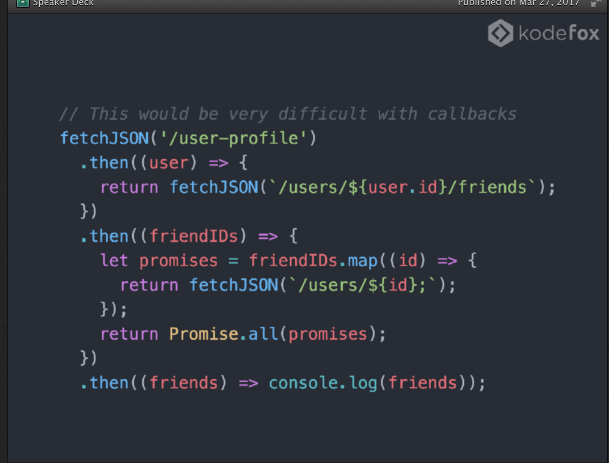
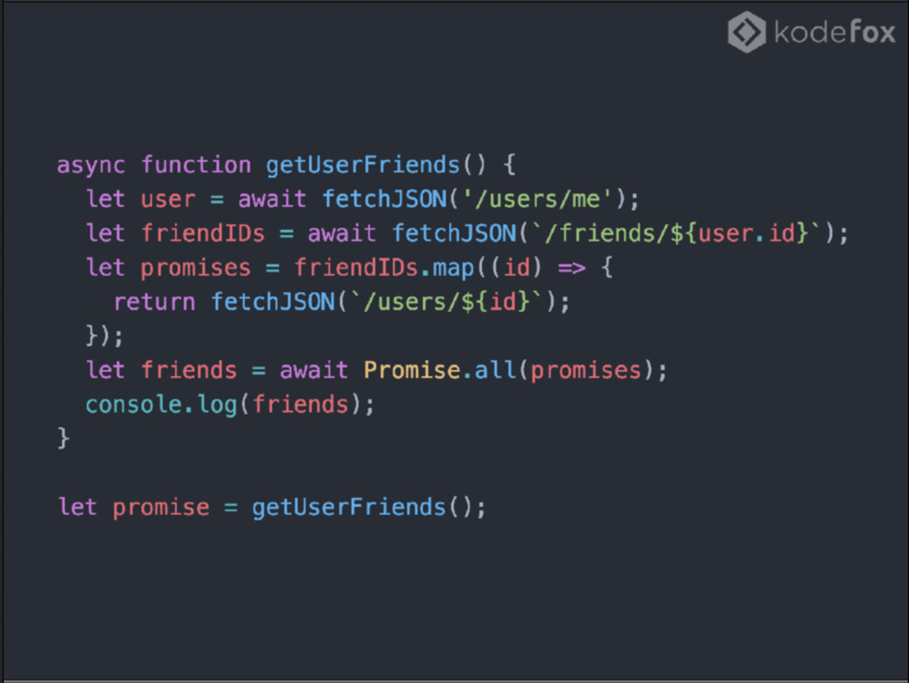

# Cleaning Up Code 
<!--s-->
What are we trying to improve
- debuggability
- readability
- ease to maintain
<!--s-->

# Example 1


<!--s-->
Code examples
- callback based
    - pyramid of doom 
        - nesting forever of doom
        - debugging 
- promise based 
    Pro 
        - readable 
    Con
        - create and resolve 
        - handle each handle
- async await using 
    Pro
        - wrap each well
        - readability high 
        - wrapping

<!--s-->
### Common Cases 

- You're making Facebook
- You make a query to load a user
    - pass the userId
    - get the users friends
    - get all the profiles of the user's friends


- [https://speakerdeck.com/sstur/async-and-await-bandungjs-mar-2017](https://speakerdeck.com/sstur/async-and-await-bandungjs-mar-2017)

<!--v-->
## Callbacks Based

```javascript
let friendProfiles = [];

// Fetch User
fetchJSON('user-profile', function(err, user) {
    if (err) {return};    
    
    // Fetch User's friends
    fetchJSON(`/users/${user.id}/friends`, function(err, friendIds) {
        if (err) {return}

        // Get All Friends Profiles
        friendIDs.map((id) => {
            fetchJSON(`/users/${id}`, (err, profile)=>{
                if (err) {friendProfiles.push(null)};
                friendProfiles.push(profile)
            })
        })

        while (friendProfiles.length != friendIds.length) {};

        return friendProfiles;
    })
})

```


<!--v-->
## Promise Based

<!--v-->
## Async Await



<!--s-->
## Example for RabbitAMQP 


#### RabbitMQ is software that sends and receives messages using channels.


 <!--v-->


 <!--v-->
Callback Based
```
#!/usr/bin/env node

var amqp = require('amqplib/callback_api');
var basename = require('path').basename;
var uuid = require('node-uuid');

var n;
try {
  if (process.argv.length < 3) throw Error('Too few args');
  n = parseInt(process.argv[2]);
}
catch (e) {
  console.error(e);
  console.warn('Usage: %s number', basename(process.argv[1]));
  process.exit(1);
}

function bail(err, conn) {
  console.error(err);
  if (conn) conn.close(function() { process.exit(1); });
}

function on_connect(err, conn) {
  if (err !== null) return bail(err);
  conn.createChannel(function(err, ch) {
    if (err !== null) return bail(err, conn);

    var correlationId = uuid();
    function maybeAnswer(msg) {
      if (msg.properties.correlationId === correlationId) {
        console.log(' [.] Got %d', msg.content.toString());
      }
      else return bail(new Error('Unexpected message'), conn);
      ch.close(function() { conn.close(); });
    }

    ch.assertQueue('', {exclusive: true}, function(err, ok) {
      if (err !== null) return bail(err, conn);
      var queue = ok.queue;
      ch.consume(queue, maybeAnswer, {noAck:true});
      console.log(' [x] Requesting fib(%d)', n);
      ch.sendToQueue('rpc_queue', Buffer.from(n.toString()), {
        replyTo: queue, correlationId: correlationId
      });
    });
  });
}

amqp.connect(on_connect);

```
###### [https://github.com/squaremo/amqp.node/blob/master/examples/tutorials/callback_api/rpc_client.js](https://github.com/squaremo/amqp.node/blob/master/examples/tutorials/callback_api/rpc_client.js)


 <!--v-->
Promise Based
```javascript
#!/usr/bin/env node

var amqp = require('amqplib');
var basename = require('path').basename;
var Promise = require('bluebird');
var uuid = require('node-uuid');

// I've departed from the form of the original RPC tutorial, which
// needlessly introduces a class definition, and doesn't even
// parameterise the request.

var n;
try {
  if (process.argv.length < 3) throw Error('Too few args');
  n = parseInt(process.argv[2]);
}
catch (e) {
  console.error(e);
  console.warn('Usage: %s number', basename(process.argv[1]));
  process.exit(1);
}

amqp.connect('amqp://localhost').then(function(conn) {
  return conn.createChannel().then(function(ch) {
    return new Promise(function(resolve) {
      var corrId = uuid();
      function maybeAnswer(msg) {
        if (msg.properties.correlationId === corrId) {
          resolve(msg.content.toString());
        }
      }

      var ok = ch.assertQueue('', {exclusive: true})
        .then(function(qok) { return qok.queue; });

      ok = ok.then(function(queue) {
        return ch.consume(queue, maybeAnswer, {noAck: true})
          .then(function() { return queue; });
      });

      ok = ok.then(function(queue) {
        console.log(' [x] Requesting fib(%d)', n);
        ch.sendToQueue('rpc_queue', Buffer.from(n.toString()), {
          correlationId: corrId, replyTo: queue
        });
      });
    });
  })
  .then(function(fibN) {
    console.log(' [.] Got %d', fibN);
  })
  .finally(function() { conn.close(); });
}).catch(console.warn);

```
###### [https://github.com/squaremo/amqp.node/blob/master/examples/tutorials/rpc_client.js](https://github.com/squaremo/amqp.node/blob/master/examples/tutorials/rpc_client.js)


 <!--v-->
Async Await
```javascript
var amqp = require('amqplib')

var open = require('amqplib').connect('amqp://localhost');

const connect = (url = 'amqp://localhost') => {
  return new Promise((resolve, reject) => {
    amqp.connect(url)
      .then(conn => resolve(conn))
      .catch(err => reject(err))
  })
}

const createChannel = conn => {
  return new Promise((resolve, reject) => {
    conn.createChannel()
      .then(channel => resolve(channel))
      .catch(err => reject(err))
  })
}


const channelAssertQueue = (channel, queueName) => {
  return new Promise((resolve, reject) => {
    channel.assertQueue(queueName)
      .then(asserted => resolve(channel))
      .catch(err => reject(err))
  })
}

const sendToQueue = (channel, queueName, buffer) => {
  channel.sendToQueue(queueName, buffer)
}


const connection = async (queueName = 'msg.*') => {
  var conn = await connect()
  var channel = await createChannel(conn)
  var assertedChannelToQueue = await channelAssertQueue(channel, queueName)
  return channel
}

module.exports = connection

```
###### [https://gist.github.com/stanzheng/788248de2e32fe50b5495999033007d7](https://gist.github.com/stanzheng/788248de2e32fe50b5495999033007d7)

<!--v-->
## 
``` javascript
const connection = async (queueName = 'msg.*') => {
  var conn = await connect()
  var channel = await createChannel(conn)
  var assertedChannelToQueue = await channelAssertQueue(channel, queueName)
  return channel
}
```
###### [https://gist.github.com/stanzheng/788248de2e32fe50b5495999033007d7](https://gist.github.com/stanzheng/788248de2e32fe50b5495999033007d7)

<!--s-->
## Your Code Now is...
